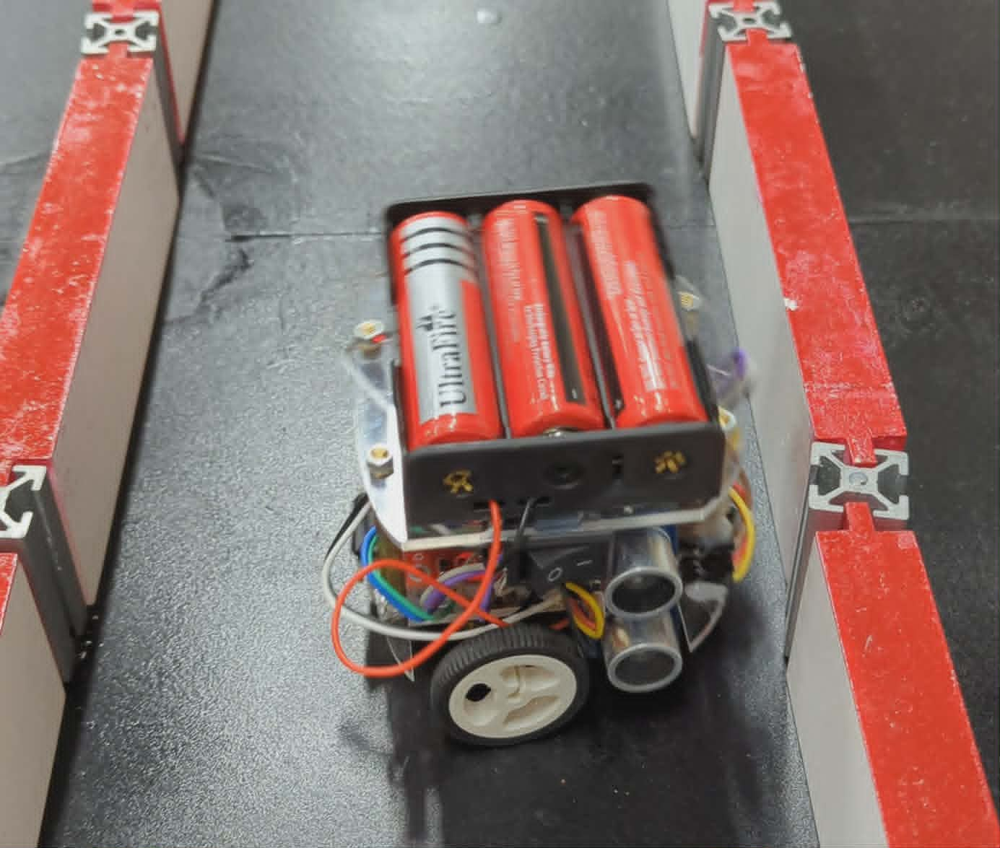

# Robot Giải Mê Cung Micromouse

## Giới thiệu

Robot Micromouse là một robot tự hành có khả năng dò đường và giải mê cung bằng cách sử dụng cảm biến khoảng cách và thuật toán backtracking. Robot trong hình được thiết kế nhỏ gọn với:

- 2 động cơ DC điều khiển bánh xe
- 2 cảm biến siêu âm HC-SR04 để phát hiện tường trái/phải
- 2 cảm biến VL53L0X ToF để đo khoảng cách phía trước
- Arduino Nano làm bộ điều khiển trung tâm
- Khay pin 18650 cung cấp nguồn cho hệ thống

Robot hoạt động bằng cách liên tục quét khoảng cách xung quanh, xác định hướng di chuyển phù hợp và ghi nhớ các lần rẽ để có thể quay lui khi gặp ngõ cụt.

---

# Hình ảnh Robot



---

# Thành phần phần cứng

| Thành phần | Chức năng |
|---|---|
| Arduino Nano | Điều khiển toàn bộ robot |
| VL53L0X | Đo khoảng cách phía trước |
| HC-SR04 | Phát hiện tường bên trái/phải |
| Driver động cơ | Điều khiển tốc độ và chiều quay |
| Động cơ DC | Di chuyển robot |
| Pin 18650 | Cung cấp nguồn |

---

# Nguyên lý hoạt động

Robot liên tục thực hiện các bước:

1. Đọc dữ liệu cảm biến
2. Kiểm tra:
   - Có tường phía trước hay không
   - Có đường bên trái/phải hay không
3. Quyết định hướng đi:
   - Đi thẳng nếu phía trước trống
   - Rẽ trái nếu trước bị chặn nhưng trái trống
   - Rẽ phải nếu trước và trái bị chặn
4. Ghi nhớ hướng rẽ bằng Stack
5. Nếu gặp ngõ cụt:
   - Lùi lại
   - Lấy hướng rẽ gần nhất từ Stack
   - Quay ngược lại hướng đó
   - Tìm đường mới

---

# Thuật toán giải mê cung

Robot sử dụng:

## Thuật toán Backtracking + Stack

### Ý tưởng chính

Mỗi lần robot rẽ:
- `'L'` được lưu vào Stack nếu rẽ trái
- `'R'` được lưu vào Stack nếu rẽ phải

Khi gặp ngõ cụt:
- Robot lấy hướng rẽ gần nhất từ Stack
- Đảo ngược hướng rẽ
- Quay lui để tìm đường khác

---

## Cấu trúc Stack

```cpp
#define MAX_STACK_SIZE 10
char moveStack[MAX_STACK_SIZE];
int stackIndex = -1;
```

---

## Hàm Push

```cpp
bool push(char move)
```

Dùng để lưu hướng rẽ.

Ví dụ:

```cpp
push('L');
push('R');
```

---

## Hàm Pop

```cpp
char pop()
```

Lấy hướng gần nhất để backtrack.

---

# Logic điều hướng

## 1. Đi thẳng

Nếu không có tường phía trước:

```cpp
if (!isFrontWall)
```

Robot sẽ:

```cpp
Move_forward();
```

---

## 2. Rẽ trái

Nếu phía trước bị chặn nhưng bên trái trống:

```cpp
if (!isLeftWall)
```

Robot:
- Rẽ trái
- Lưu `'L'` vào stack
- Tiếp tục tiến

---

## 3. Rẽ phải

Nếu trái bị chặn nhưng phải trống:

```cpp
if (!isRightWall)
```

Robot:
- Rẽ phải
- Lưu `'R'`
- Tiếp tục tiến

---

## 4. Gặp ngõ cụt

Điều kiện:

```cpp
if (isFrontWall && isLeftWall && isRightWall)
```

Robot:
- Lùi lại
- Pop hướng gần nhất
- Đảo hướng rẽ
- Chọn đường mới

---

# Cơ chế phát hiện tường

## Cảm biến VL53L0X

Dùng để đo khoảng cách phía trước bằng tia laser ToF.

Điều kiện có tường:

```cpp
frontDistance < 48
```

---

## Cảm biến siêu âm HC-SR04

Dùng để đo khoảng cách bên trái và bên phải.

Điều kiện có tường:

```cpp
leftDistance <= 8
rightDistance <= 8
```

---

# Sơ đồ kết nối

## VL53L0X

| VL53L0X | Arduino Nano |
|---|---|
| SDA | A4 |
| SCL | A5 |
| XSHUT1 | D8 |
| XSHUT2 | D9 |

---

## HC-SR04

| HC-SR04 | Arduino Nano |
|---|---|
| Trig Left | D2 |
| Echo Left | D3 |
| Trig Right | D4 |
| Echo Right | D5 |

---

## Driver động cơ

| Driver | Arduino Nano |
|---|---|
| IN1 | D10 |
| IN2 | D11 |
| IN3 | D12 |
| IN4 | D13 |

---

## PWM tốc độ

| PWM | Arduino Nano |
|---|---|
| ENA | A0 |
| ENB | A1 |

---

# Điều khiển động cơ

## Đi thẳng

```cpp
digitalWrite(motor1pin1, LOW);
digitalWrite(motor1pin2, HIGH);
digitalWrite(motor2pin1, LOW);
digitalWrite(motor2pin2, HIGH);
```

---

## Rẽ trái

```cpp
digitalWrite(motor1pin1, LOW);
digitalWrite(motor1pin2, HIGH);

digitalWrite(motor2pin1, HIGH);
digitalWrite(motor2pin2, LOW);
```

---

## Rẽ phải

```cpp
digitalWrite(motor1pin1, HIGH);
digitalWrite(motor1pin2, LOW);

digitalWrite(motor2pin1, LOW);
digitalWrite(motor2pin2, HIGH);
```

---
